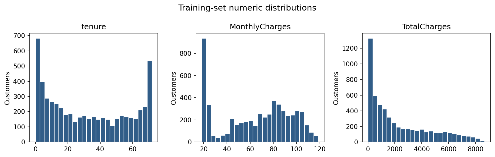
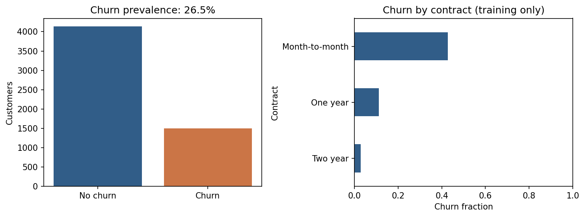
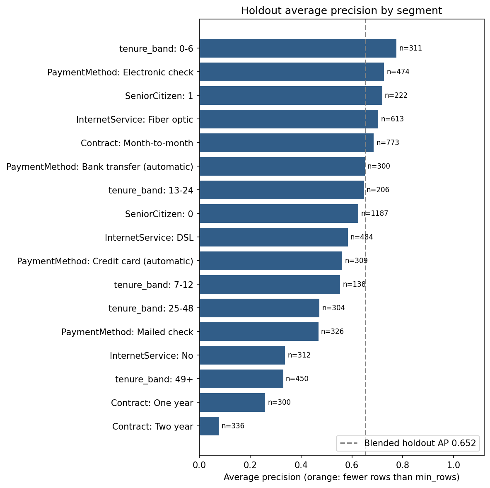
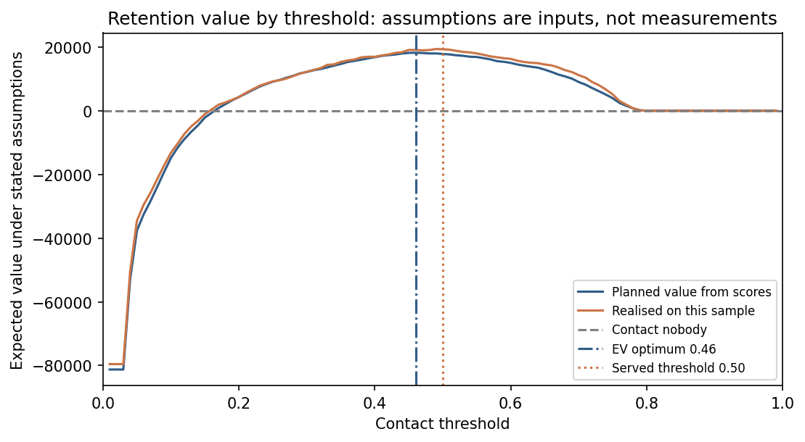
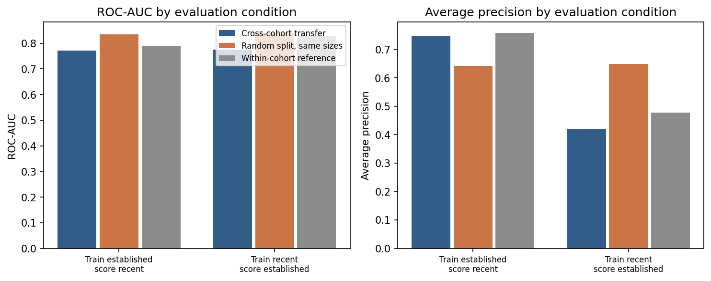

# Telco customer churn: from a risk score to a retention decision

When a telecom customer cancels their service, the company loses all the future
revenue that customer would have paid. This project takes a single customer
record — contract type, monthly charges, which services they subscribe to, how long
they have been a customer — and answers two questions. First, how likely is this
person to cancel? Second, and more usefully, is it worth spending money to try to
keep them? The second question is the one a retention team actually has to answer,
and a probability on its own does not answer it. A customer at 40% risk who pays a
high monthly bill can be worth a retention offer; a customer at 60% risk on a cheap
plan can be worth nothing. This repository contains a trained model, a service that
serves it, and a costing layer that turns its scores into a ranked list of who to
contact — including the case where the honest answer is to contact nobody at all.

```json
{"prediction": 1, "churn": "Yes", "churn_probability": 0.7975335395589493, "threshold": 0.5}
```

---

## Contents

- [What this is for](#what-this-is-for)
- [The value it adds](#the-value-it-adds)
- [Quick start](#quick-start)
- [How it works](#how-it-works)
- [Architecture](#architecture)
- [Features](#features)
- [How it was built, step by step](#how-it-was-built-step-by-step)
- [Design decisions and reasoning](#design-decisions-and-reasoning)
- [Results](#results)
- [Model development](#model-development)
- [Transfer to newer customers](#transfer-to-newer-customers)
- [Repository layout](#repository-layout)
- [Running everything](#running-everything)
- [The service](#the-service)
- [Scope and assumptions](#scope-and-assumptions)
- [With two more days](#with-two-more-days)
- [Dataset and licence](#dataset-and-licence)
- [Author](#author)

---

## What this is for

**Churn** is the industry word for a customer cancelling. A churned customer is one
who was paying you last month and is not paying you this month.

Telecom companies care about this more than almost any other number, for a simple
commercial reason: keeping an existing customer is much cheaper than winning a new
one. Acquiring a customer means advertising, sales effort, discounted handsets and
onboarding costs. Keeping one who is thinking of leaving often means a phone call
and a modest offer. The same revenue is far cheaper to defend than to replace, so a
retention team that knows which customers are about to leave can spend a small
budget where it does the most good.

The difficulty is that a retention team cannot phone everybody. Contacting a
customer costs money, and the retention offer costs more. Contacting a customer who
was never going to leave is pure expense: you have just paid to discount the bill of
someone who was perfectly happy. So the real task is not "who might leave" but
"which few hundred people should we call this week, and what do we expect to get
back".

This repository addresses that task on the public Kaggle *Telco Customer Churn*
dataset: 7,043 customers, 21 columns, one row per customer, with a Yes/No churn
label.

## The value it adds

Most churn projects stop at a score. They hand the business a number between 0 and
1 for each customer and leave the hard part — what to do about it — to a meeting.
A score alone cannot be acted on, because it says nothing about money.

This project adds the money. Three things follow from that.

**It decides who is worth contacting, not just who is likely to leave.** Every
customer gets their own break-even risk level, derived from their own margin. A
customer paying a high monthly charge is worth saving at a lower probability of
leaving than a customer paying a little, because there is more revenue to defend.
A single company-wide cutoff cannot be right for both at once. On the training
partition, contacting each customer whose own expected value is positive returns
**21,123** against **18,201** for the best single cutoff available — 16% more value,
from contacting *fewer* people (1,331 against 1,439), and with **zero**
value-destroying contacts instead of 243.

**It says when the campaign is not worth running.** Across a grid of plausible
assumptions about how often a retention offer actually works and how much it costs,
**8 of 25 combinations return nothing at all**. At a 5% save rate the campaign
destroys value unless the offer is free. A system that reports only a single return
on investment hides this; a system that reports the surface makes the decision to
*not* run the campaign a visible, defensible option.

**It says where its own answers are untrustworthy.** At the served cutoff the model
flags **zero** two-year-contract customers — its highest score anywhere in that
segment is 0.417, below the 0.5 line. One- and two-year contracts are 45% of the
holdout and hold 54% of every churner the model misses. That is stated here, in the
headline results, rather than buried. A low score on a long contract is *no
information*, not low risk, and a team acting on this output needs to know that
before it trusts a quiet-looking segment.

## Quick start

```bash
make setup && make predict          # macOS / Linux
.\setup.ps1                          # Windows PowerShell
```

Python 3.10 or 3.11. The trained model and its checksum manifest are committed, so
inference needs no dataset and no retraining. Commands run from any directory.

## How it works

The path from a customer record to a decision has four stages. Each is described in
plain terms first.

**1. A raw customer record arrives.** It looks like a row from a billing system: a
contract type, a monthly charge, a tenure in months, and a set of yes/no service
flags. It may arrive as JSON on an HTTP request, as a file given to the CLI, or as a
batch for scoring.

**2. The record is validated before anything else happens.** The system checks that
all 19 feature fields are present, that numbers are numbers, that tenure is a whole
number of months, and that nothing contradicts the declared input contract. A
malformed record is rejected with a specific message rather than quietly scored.
Rejecting early matters because a prediction made from a corrupted record looks
exactly as confident as a good one.

**3. The record goes through a single pipeline and a probability comes out.** The
pipeline is one object that does every step in order: clean the raw fields, fill in
missing numbers with the training median, put the numbers on a common scale, convert
the categories into columns the model can read, then apply the trained Random Forest.
The output is a probability of cancelling — for example 0.7975.

Three terms are worth defining here, because the rest of the document uses them.

- **Cross-validation** is how the model's quality was measured before it ever saw
  the final test data. The training data is split into five parts; the model is
  trained on four and scored on the fifth, five times over, and the scores are
  averaged. This gives a more stable estimate than a single split would.
- **Data leakage** is when information from the data used to score a model sneaks
  into the data used to train it — for example, filling in missing values using the
  average of the whole dataset including the test rows. A leaking model scores well
  in testing and then disappoints in production, because its test score was partly
  measuring its own answers. Keeping every learned step inside the pipeline, so it
  is re-learned from scratch on each fold, is what prevents this.
- **Calibration** means the probabilities can be read as real risk levels: when the
  model says 70%, roughly 70% of those customers should actually leave. A model can
  rank customers correctly and still be badly calibrated — putting the right people
  at the top of the list while overstating everybody's risk.

**4. The costing layer turns the probability into a decision.** This is the stage
most churn projects omit. For each customer it works out the **expected value** of
contacting them — on average, across many customers like this one, does making the
call make money or lose money? The arithmetic uses the customer's own retained
value (30% margin on their monthly charge over a 12-month horizon), the cost of the
contact, the cost of the offer, how often the offer is accepted, and how much the
offer actually lifts the chance of keeping them. If the answer is positive, the
customer goes on the worklist, ranked by how positive. If it is negative, they do
not. And because the save rate is an assumption rather than a measurement, the layer
reports the whole surface of outcomes across plausible assumptions, not one number.

Calibration matters specifically for this last stage. Expected-value arithmetic
multiplies probabilities by sums of money. If the probabilities are inflated by 48%,
every expected value is inflated with them, and the decision boundary moves to the
wrong place.

### What the data looks like

Before any modelling, `notebooks/eda.ipynb` establishes the shape of the inputs and
where churn concentrates.



Distributions of the numeric fields on the training rows.



Churn rate by contract and by tenure.

Two facts from this stage change decisions later: `TotalCharges` arrives as a string
with blank values, and churn is present in 26.54% of training rows rather than half
of them.

## Architecture

```
                        Kaggle CSV (7,043 x 21)
                                 |
                                 v
                   data.py  +  schema.py / json_input.py
                 validate types, clean, stratified 80/20
                     split, seed 42 -> 5,634 / 1,409
                                 |
                                 v
                              train.py
          one sklearn Pipeline: clean -> impute -> scale ->
                       one-hot -> estimator
                                 |
                                 v
                      artifacts/ via artifact.py
             model.joblib + SHA-256 manifest (fails closed)
                                 |
      +--------------------------+--------------------------+
      |                          |                          |
      v                          v                          v
  EVALUATION                 SERVING                   CALIBRATION
  segments.py            predict.py  (CLI)             calibrate.py
  cohort.py              api.py (FastAPI)         model_calibrated.joblib
  diagnostics.py                                   oof_probabilities.csv
  read the model          raw probability                   |
  without changing it     per customer                      v
                                                        policy.py
                                              expected value per customer
                                                + sensitivity surface
                                                            |
                                                            v
                                                      score_batch.py
                                                   ranked worklist CSV
```

The split after `artifacts/` is the important part. Evaluation and serving read the
model and leave it alone. Only the worklist goes through the costing layer, because
only the worklist is a spending decision — `predict.py` and `api.py` answer "how
likely is this customer to cancel", which needs no cost assumptions at all.

1. **The dataset** is fetched by `make data`, which verifies its SHA-256 before
   writing it to disk.
2. **`data.py`** validates and cleans the raw columns, then makes one stratified
   80/20 split under seed 42 — 5,634 training rows, 1,409 holdout rows. `schema.py`
   and `json_input.py` enforce the same input contract at prediction time.
3. **`train.py`** fits a single sklearn `Pipeline` containing every learned step, so
   that cleaning, imputation, scaling and one-hot encoding are re-learned inside each
   cross-validation fold rather than once over everything.
4. **`artifact.py`** writes `model.joblib` alongside a manifest pinning the schema
   version, the scikit-learn version and the file's SHA-256. Loading verifies all
   three and refuses to serve a mismatched or corrupt artifact.
5. **Three evaluation branches** read the trained model without altering it:
   `segments.py` scores each contract and tenure segment separately, `cohort.py`
   measures transfer from established to recent customers, and `diagnostics.py`
   produces curves and bootstrap intervals.
6. **`calibrate.py`** fits sigmoid calibration and writes a separate calibrated
   artifact plus `oof_probabilities.csv` — out-of-fold probabilities, meaning each
   customer's score comes from a model that did not train on that customer.
7. **`policy.py`** consumes those out-of-fold probabilities and produces per-customer
   expected values, break-even probabilities and the sensitivity surface.
8. **`score_batch.py`** applies that policy to produce `reports/worklist.csv`, the
   ranked contact list. It is the only consumer that needs cost assumptions, because
   it is the only one making a spending decision. `predict.py` and `api.py` sit
   directly on the model and return a probability, with no economics involved.

## Features

### Modelling

| Feature | What it gives you | Boundary |
|---|---|---|
| Leakage-safe sklearn `Pipeline` | Every learned step re-fitted inside each fold | Asserted by test; the imputer never sees prediction-time rows |
| Baseline and tuned ensemble | Logistic Regression against a tuned Random Forest | Forest is the winner of a pre-declared rule, not statistically superior |
| Seeded stratified cross-validation | Reproducible five-fold selection over eight configurations | Selection on training folds only; the holdout played no part |
| Bootstrap intervals | 95% intervals on the headline metrics | Sampling variation only; excludes training and selection uncertainty |

### Serving

| Feature | What it gives you | Boundary |
|---|---|---|
| One-customer CLI | `make predict` returns a label and a probability from raw JSON | Single record per invocation |
| FastAPI service | `/health`, `/predict`, `/predict/batch`, `/docs` | Local serving; no auth, rate limiting or TLS |
| Strict input contract | Specific 4xx messages for every contract violation | Unknown category strings are accepted by the fitted encoder |
| Integrity manifest | Schema, library version and SHA-256 verified on load | Detects corruption, not a hostile publisher |
| Container | Repeatable serving image, non-root user | Built and smoke-tested in CI |

### Decision layer

| Feature | What it gives you | Boundary |
|---|---|---|
| Per-customer expected value | A contact decision with money attached, not a score | Assumptions are inputs, reported alongside results |
| Ranked worklist | `reports/worklist.csv` with per-customer break-even on each row | Priorities for review, not approved actions |
| Sensitivity surface | The assumption ranges under which the programme returns nothing | Arithmetic on stated planning benchmarks, not a forecast |
| Calibrated artifact | Probabilities usable as risk levels | Opt-in artifact; the served default is unchanged |

### Evaluation

| Feature | What it gives you | Boundary |
|---|---|---|
| Segment report | Where the model should not be trusted | Holdout diagnostic; not a fairness audit |
| Cohort transfer | Degradation under realistic distribution shift | Tenure proxies arrival cohort, not time |
| SHAP contributions | Top raw-feature contributions per prediction | Forest only; associations, not causes |
| Executed EDA | Distributions and feature types in `notebooks/eda.ipynb` | Committed with outputs |

### Operations

| Feature | What it gives you | Boundary |
|---|---|---|
| PSI drift check | Training reference against current inputs, 0.2 review flag | Covers numeric covariate shift, not concept drift |
| MLflow tracking | Metrics, parameters, data hash and artifacts | Opt-in local tracking; no customer rows logged |
| One-command setup | `make setup` on Unix, `setup.ps1` on Windows | Python 3.10 and 3.11, by manifest design |
| Byte-reproducible reports | `make reports` regenerates every committed report exactly | Fixed seed; same library versions |

Optional dependencies for MLflow and SHAP are in `requirements-optional.txt`.

## How it was built, step by step

The order of these steps is the substance of the engineering. Each one exists in the
position it does for a reason, and several of them would be wrong anywhere else in
the sequence.

**1. Explore the data before touching a model.** `notebooks/eda.ipynb` establishes
the distributions, the feature types and the two data problems that matter:
`TotalCharges` arrives as a string with blank values, and churn is present in 26.54%
of training rows rather than half of them. Both facts change decisions later, so
they are established first.

**2. Split the data before anything is learned.** `data.py` makes one stratified
80/20 split under seed 42 — 5,634 training and 1,409 holdout rows — and does it
before any imputation statistic, any scaler and any encoding vocabulary exists. This
ordering is the whole defence against leakage. If a median or a category list were
computed over the full dataset first, the holdout would already be contaminated and
every number measured against it would be optimistic for a reason no later step
could detect.

**3. Put every learned step inside one pipeline.** Cleaning, numeric median
imputation, scaling, categorical mode imputation and one-hot encoding are stages of
a single sklearn `Pipeline` with the estimator at the end. This is what makes step 2
hold during cross-validation as well: when the pipeline is passed to a
cross-validator, each fold re-learns its own medians and vocabularies from its own
training rows. A test asserts that the imputer's learned median never moves in
response to prediction-time rows.

**4. Fit an interpretable baseline first.** Logistic Regression comes before the
ensemble, with balanced class weights. A baseline is not a formality: it sets the
bar that any more complex model has to clear to justify its existence, and here it
reaches CV ROC-AUC 0.8459 and average precision 0.6600 — close enough to the forest
that the comparison has to be made carefully rather than assumed.

**5. Choose the metric before reading any result.** Average precision is the
selection metric, because under 26.5% churn accuracy is actively misleading: a model
that predicts "nobody leaves" scores about 73.5% and finds no one. ROC-AUC measures
ranking across all cutoffs, average precision focuses on the precision/recall
trade-off in the minority class, and F1 reports a single operating point. Fixing this
before looking at scores is what stops the metric being chosen to flatter the result.

**6. Tune the ensemble on training folds only.** Eight Random Forest configurations
across seeded stratified five-fold cross-validation, selected on training CV average
precision. The holdout is not consulted. The selected configuration is 150 trees,
depth 6, leaf size 2, feature fraction 0.7.

**7. Read the holdout once, as a measurement rather than a choice.** The tuned
forest reaches holdout ROC-AUC 0.8449, AP 0.6523, F1 0.6332. Because selection
already happened in step 6, these numbers are an estimate of performance rather than
part of the search. Bootstrap intervals over 500 resamples put ROC-AUC at
0.8222–0.8669 and AP at 0.5986–0.7037 — intervals wide enough to contain the
forest's margin over the baseline, which is why the forest is reported as the winner
of a pre-declared selection rule and not as statistically superior.

**8. Persist the model with an integrity manifest.** `artifact.py` writes
`model.joblib` with a manifest pinning the schema version, the scikit-learn version
and the SHA-256 of the file. `load_model` verifies all three and fails closed. This
comes before any serving work, because a service that can be pointed at a stale or
corrupt artifact has no reliable behaviour to test.

**9. Break the blended score apart before trusting it.** `segments.py` scores each
contract and tenure segment separately, and this is where the single most important
operational finding appears: the model flags nobody on a two-year contract at any
input, because 0.417 is the highest score it assigns in that segment. A blended
ROC-AUC of 0.845 cannot surface that. Running this before the decision layer is what
keeps the decision layer from quietly costing a campaign over a segment the model
cannot see into.

**10. Test transfer to customers who arrive later.** `cohort.py` trains on
established customers at 12+ months tenure and scores the recent cohort below it,
against a random-split control at identical sizes. Random validation assumes the
training and serving populations share a distribution; a deployed model does not get
that assumption. The 0.065 ROC-AUC gap is the cost of that assumption being wrong.

**11. Calibrate, and do it before the money arrives.** Across training outer folds
the forest predicts a mean churn probability of 0.3928 against an observed 0.2654 —
a relative overstatement of about 48%. Sigmoid calibration brings the mean to 0.2646.
This step must precede the costing layer, not follow it: expected value is a
probability multiplied by a sum of money, so arithmetic performed on probabilities
that are 48% too high is wrong by the same margin, and the break-even boundary lands
in the wrong place. The calibrated model ships as a separate artifact and
`oof_probabilities.csv` carries out-of-fold scores, so the costing layer never reads
a probability from a model that trained on that customer.

**12. Build the decision layer last, on calibrated out-of-fold scores.**
`policy.py` computes each customer's retained value, their own break-even
probability, and the expected value of contacting them, then compares the
per-customer rule against contact-nobody, contact-everybody and every single
threshold. `score_batch.py` turns the result into `reports/worklist.csv`. Because
the save rate is an assumption, the layer also sweeps uplift against offer cost and
reports where the programme returns nothing — the sensitivity surface, rather than a
single figure, is the deliverable.

## Design decisions and reasoning

**One sklearn `Pipeline` rather than a preprocessing script.** Preprocessing that
runs before cross-validation learns from the data it is about to be scored on. Inside
a pipeline, each fold re-learns its own medians, scales and category vocabularies from
its own training rows, so the cross-validation estimate measures the whole procedure
rather than the estimator alone. The leakage boundary is then a property of the code
and can be asserted by a test, instead of a convention that holds until someone
reorders two cells.

**Selection on training CV average precision, never on the holdout.** A holdout read
during model selection becomes part of the search and stops being an independent
estimate. Declaring the selection rule in advance and running it on training folds
keeps one honest number in the repository. It also means the holdout result can be
reported plainly, without an argument about how many configurations it saw.

**Balanced class weights instead of oversampling.** Oversampling before
cross-validation duplicates minority rows across the fold boundary, so the same
customer appears in training and validation and the estimate inflates. Class weights
achieve the same reweighting inside the estimator, fold-locally, with no duplicated
rows and nothing to get wrong in the fold ordering.

**Average precision over accuracy under 26.5% churn.** Accuracy rewards the majority
class. An always-predict-no-churn model scores about 73.5% here and identifies
nobody, which is worth exactly nothing to a retention team. Average precision
summarises the precision/recall trade-off across the minority class, which is the
trade-off the business actually faces: each flagged customer costs money whether or
not they were going to leave.

**A checksum manifest that fails closed.** The model file and its manifest are a
pair. `load_model` verifies the schema version, the scikit-learn version and the
SHA-256, and refuses to serve rather than predicting from a mismatched artifact.
Silent degradation is the worst failure mode a model service has, because it produces
confident output indefinitely. Failing closed converts that into an immediate, loud
error at startup.

**Per-customer retained value instead of a flat figure.** A single average value per
saved customer makes the break-even probability the same for everyone, which is
exactly the assumption that is false. Margin varies with monthly charges, so the
risk level at which a contact becomes worthwhile varies too. The per-customer rule
returns 21,123 against 18,201 for the best single threshold while contacting fewer
people and making no value-destroying contacts, and the mechanism is simply that it
asks a different question of each customer.

**Calibration as a separate opt-in artifact.** Replacing the served model with a
calibrated one would change the behaviour of every consumer at once, including the
served default output and its tests. Shipping `model_calibrated.joblib` alongside
the default keeps the served artifact byte-stable while giving the decision layer
the probabilities it needs. The two agree on ranking — sigmoid calibration is a
monotone map — so nothing about the ordering is at stake in the choice.

**A sensitivity surface instead of a single ROI number.** The save rate is the term
the whole business case rests on, and this dataset cannot measure it. Quoting one
return would present an assumption as a finding. Sweeping uplift against offer cost
and reporting that 8 of 25 combinations return nothing puts the real conclusion in
front of the reader: the programme's viability rests on the save rate, not on the
model, and measuring the uplift is worth more than any further modelling.

**No second ensemble, and no production infrastructure.** XGBoost or LightGBM would
add another gradient-boosted tree model to a problem where a tuned forest and a
logistic regression already sit within each other's bootstrap intervals; a third
model of the same family adds no signal, only another artifact to maintain and
another selection decision to defend. Kubernetes, authentication and a feature store
belong to an operating environment this system does not have — there is no traffic to
scale, no tenancy to separate and no upstream feature producer to share with. The
engineering effort went instead into the leakage boundary, the integrity manifest,
the segment and cohort evidence and the decision layer, which are the parts that
change what the output is worth.

## Results

### The model ranks well, but its probabilities are not risk levels

Across training outer folds the tuned forest predicts a mean churn probability of
**0.3928** against an observed rate of **0.2654** — overstating risk by 48% in relative
terms. Sigmoid calibration brings the mean to **0.2646** against 0.2654 observed:

| | Mean predicted | Brier | Log loss | ROC-AUC |
|---|---:|---:|---:|---:|
| Tuned forest | 0.3928 | 0.1570 | 0.4692 | 0.8467 |
| Calibrated | **0.2646** | **0.1352** | **0.4176** | 0.8465 |


Reliability and score distribution, raw against calibrated.

Ranking is unchanged, as a monotone map implies. What changes is that the output becomes
usable as a risk level — which is the precondition for costing a decision on it. The
calibrated model is a separate artifact; the served default is untouched.

### At the served threshold the classifier is blind to 45% of the customer base

Blended holdout ROC-AUC is 0.845. By contract type:

| Contract | n | Churn rate | Flagged at 0.5 | Churners found | Max score |
|---|---:|---:|---:|---:|---:|
| Month-to-month | 773 | 42.6% | 538 | 290 of 329 | 0.947 |
| One year | 300 | 12.0% | 4 | **0 of 36** | 0.544 |
| Two year | 336 | 2.7% | **0** | **0 of 9** | **0.417** |



Average precision per segment against the overall value, with sample sizes.

No two-year customer can cross 0.5 at any input: 0.417 is the highest score the model
assigns anywhere in that segment. These two segments are **45% of the holdout** and hold
**54% of every churner the model misses**.

Ranking inside them is sound — ROC-AUC 0.738 and 0.766. The failure is a fixed cutoff
meeting a low base rate, which no blended metric can surface. A low score on a long
contract is therefore *no information*, not low risk. Two-year average precision is
0.076 against 0.652 blended, which is the same fact stated in the metric the selection
rule used.

### The correct retention policy is not a threshold

Under documented cost assumptions, on the training partition:

| Policy | Contacted | Expected value | Value-destroying contacts |
|---|---:|---:|---:|
| Contact nobody | 0 | 0 | 0 |
| Contact everybody | 5,634 | **−81,262** | 4,303 |
| Served threshold 0.5 | 1,277 | 17,814 | 197 |
| Best single threshold (0.46) | 1,439 | 18,201 | 243 |
| **Per-customer expected value** | 1,331 | **21,123** | **0** |



Expected value against the contact threshold, with the optimum and the served 0.5 marked.

Contacting each customer whose own expected value is positive beats the best available
threshold by **16%**, while contacting fewer people and making no value-destroying
contacts. A high-margin customer is worth saving at 40% risk; a low-margin one is not at
60%. No single cutoff can be correct for both.

The served 0.5 was already near-optimal among thresholds. The threshold was not the
error — the instrument was.

**The programme's viability rests on the save rate, not on the model.** Across uplift and
offer cost, **8 of 25 assumption combinations return nothing at all**. At a 5% save rate
the campaign is value-destroying unless the offer is free. That is the result the
sensitivity surface exists to produce, and it is why measuring the uplift leads the
roadmap below.

## Model development

| Model | CV ROC-AUC | CV AP | CV F1 | Holdout ROC-AUC | Holdout AP | Holdout F1 |
|---|---:|---:|---:|---:|---:|---:|
| Logistic Regression | 0.8459 | 0.6600 | 0.6279 | 0.8413 | 0.6326 | 0.6136 |
| Tuned Random Forest | 0.8480 | 0.6643 | 0.6324 | 0.8449 | 0.6523 | 0.6332 |

- Seed 42; stratified 80/20 split: 5,634 training and 1,409 holdout rows. Training churn
  prevalence 26.54%. Balanced class weights, no pre-CV oversampling.
- Cleaning, numeric median imputation and scaling, categorical mode imputation and
  one-hot encoding, and the estimator form one sklearn `Pipeline`, so learned
  preprocessing stays inside every fold. A test asserts the imputer never learns from
  prediction-time rows.
- Five-fold stratified CV across eight forest configurations. Selection uses **training
  CV average precision**; holdout scores played no part. Selected: 150 trees, depth 6,
  leaf size 2, feature fraction 0.7.
- Holdout precision 0.5351, recall 0.7754, TN/FP/FN/TP = 783/252/84/290 at threshold 0.5.
  Two in five flagged customers would not have churned, which is what makes the cost
  layer necessary rather than decorative.
- 95% bootstrap intervals (500 resamples): ROC-AUC 0.8222–0.8669, AP 0.5986–0.7037. The
  forest's margin over the baseline falls inside these intervals, so the forest is
  reported as the winner of a pre-declared selection rule, not as statistically superior.


ROC, precision-recall and reliability on the holdout.


The drop in average precision when each raw feature is shuffled.

**Why accuracy is insufficient.** Always-predict-no-churn scores ~73.5% on this data and
finds nobody. ROC-AUC measures ranking, average precision emphasises the
precision/recall trade-off under 26.5% prevalence, and F1 reflects a chosen operating
point. PR-AUC here means sklearn average precision.

## Transfer to newer customers

Random validation assumes training and serving data share a distribution. A deployed
model scores customers who arrive later. This dataset carries no timestamps, so tenure
serves as a proxy for arrival cohort: 3,996 established customers at 12+ months against
1,638 recent customers below it.

| Established (12+ months) → recent (under 12) | ROC-AUC | Average precision |
|---|---:|---:|
| Cross-cohort transfer | 0.7707 | 0.7481 |
| Random split, same population and sizes | **0.8357** | 0.6420 |
| Within-cohort reference | 0.7898 | 0.7584 |



Cross-cohort transfer against the random-split control and the within-cohort reference.

The 0.065 ROC-AUC gap against the control is the result: the control fixes population and
sample size, so the gap is attributable to cohort structure rather than to either. The
within-cohort reference separates transfer loss from the intrinsic difficulty of new
customers, who churn at 48.2% against 17.6%. Average precision rises under transfer as a
base-rate artifact of that higher churn rate, so ROC-AUC is the comparable metric.

Tenure is a cohort proxy, not a timestamp; this is distribution-shift evidence, not
temporal validation.

## Repository layout

```
src/telco_churn/   data.py schema.py json_input.py  (validation + split)
                   train.py artifact.py            (pipeline, training, integrity)
                   calibrate.py                    (calibrated artifact + OOF scores)
                   policy.py score_batch.py        (decision layer, worklist)
                   segments.py cohort.py diagnostics.py  (evaluation)
                   drift.py explain.py tracking.py (monitoring, SHAP, MLflow)
                   api.py inference.py paths.py    (serving, path resolution)
                   threshold.py calibration_experiment.py  (threshold + calibration studies)
predict.py         one-customer CLI
download_data.py   dataset fetch with checksum verification
artifacts/         model.joblib + manifest, model_calibrated.joblib + manifest,
                   oof_probabilities.csv, metrics.json, cv_results.csv, drift_reference.json
reports/           policy.json segments.{json,md} cohort_shift.json diagnostics.json
                   worklist.csv calibration_served.json + figures
docs/              model_card.md operations.md experiments.md rubric.md
notebooks/eda.ipynb   executed exploratory analysis
Makefile setup.ps1    one-command setup for Unix and Windows
Dockerfile .github/workflows/tests.yml
```

20 modules in `src/telco_churn/`, 2,778 lines of source against 1,203 lines of tests.

## Running everything

```bash
make test        # 144 tests
make lint        # ruff check and format
make reports     # regenerate every report below
make data        # fetch the dataset, verifying its SHA-256
```

```bash
python -m telco_churn.calibrate                                             # calibrated artifact + out-of-fold scores
python -m telco_churn.policy --probabilities artifacts/oof_probabilities.csv  # decision analysis
python -m telco_churn.score_batch --budget 200                              # ranked worklist
python -m telco_churn.segments                                              # per-segment performance
python -m telco_churn.cohort                                                # cohort transfer
```

`reports/worklist.csv` is the operational output: customers ordered by expected value,
each with their own break-even probability, so the reason a customer qualified is visible
on the row. Regenerating every report reproduces the committed files byte for byte.

Evidence: `artifacts/metrics.json`, `reports/policy.json`, `reports/segments.md`,
`reports/cohort_shift.json`, `reports/diagnostics.json`, and executed EDA in
`notebooks/eda.ipynb`. The [model card](docs/model_card.md) states intended and
out-of-scope use. See also [operations](docs/operations.md),
[experiments](docs/experiments.md) and the [requirement audit](docs/rubric.md).

## The service

```bash
uvicorn telco_churn.api:app --host 127.0.0.1 --port 8000
curl -H 'Content-Type: application/json' --data @sample_customer.json http://127.0.0.1:8000/predict
```

`/health`, `/predict`, `/predict/batch` (1–100 profiles), `/docs`. Pydantic validation
with clean 422s, bounded request bodies, load-once startup checks, atomic batch failure,
and no logging of profiles or identifiers.

Input handling is strict by contract: all 19 feature fields required, `customerID`
optional and never modelled, numeric strings and nulls accepted, blanks imputed. Invalid
scalar types, negative or non-finite numbers, fractional tenure, out-of-range
`SeniorCitizen`, duplicate JSON keys and unexpected fields each fail with a specific
message. A wrong content type returns 415, a body over 256 KiB returns 413, and
malformed JSON, duplicate keys and contract violations return 422. Unknown category
strings are accepted by the fitted encoder.

The model file and its manifest are a pair: `load_model` verifies schema version,
scikit-learn version and SHA-256, and fails closed rather than serving predictions from a
corrupt or mismatched artifact. 144 tests cover contracts, model integrity,
serialisation round-trips, the leakage boundary, the decision layer and the CLI. CI runs
them on Python 3.10 and 3.11, lints, builds the container and smoke-tests a real
prediction through it.

## Scope and assumptions

Every currency figure is arithmetic on stated assumptions: 30% margin on charges, a
12-month horizon, $2 per contact, a $60 offer, 50% acceptance, 25% uplift. At those
defaults the mean retained value is 233.75 and the break-even churn probability at that
mean is 0.548. These are documented planning benchmarks rather than measurements from
this dataset, which is why the sensitivity surface — not any single figure — is the
deliverable, and why no number here is presented as a forecast or an approved operating
threshold.

The system serves a model and a decision locally. Authentication, rate limiting, TLS,
load testing and a labelled feedback loop are outside its scope; the model card records
where the model should not be used, including any decision about an individual's price or
eligibility. `joblib` uses pickle, so only trusted local artifacts are loaded — the
manifest checksum detects corruption, not a hostile publisher. Drift monitoring covers
numeric covariate shift, not concept drift, and the segment report is a holdout
diagnostic rather than a fairness audit.

The dataset is a single static public extract with no timestamps, tariff detail or record
of prior retention action. It supports the analysis above and cannot establish future
business performance for a real operator.

## With two more days

1. **Measure the uplift.** Every currency figure here is sensitivity analysis because the
   save rate is unknown. A randomised holdback on the next campaign converts the decision
   layer from parameterised arithmetic into a measured business case. Nothing else on
   this list changes as much.
2. **Close the long-contract blind spot.** The classifier cannot flag one- and two-year
   customers at any conventional cutoff, and they hold over half the missed churners.
   Per-segment operating points, or a model fitted within those segments, with the
   validation plan declared before looking — not retuned against a holdout already read.
3. **Build the feedback loop.** Churn labels arrive months after the prediction, so
   monitoring needs delayed-label joins before a retraining trigger can be honest. Add
   categorical drift, subgroup calibration, clear ownership and rollback criteria.

## Dataset and licence

The data is the Kaggle *Telco Customer Churn* dataset published by **blastchar**:
7,043 rows, 21 columns, one row per customer. It is **not redistributed in this
repository**. `make data` fetches it and verifies its SHA-256 before use; if you already
have the CSV, `python download_data.py --csv <file>` adopts a manual download with no
network call. Use of the dataset is subject to its terms on Kaggle. The trained model
and its manifest are committed, so every inference path in this repository works without
the dataset present.

## Author

Hitansh Gopani — [hitansh-portfolio-zeta.vercel.app](https://hitansh-portfolio-zeta.vercel.app/)
