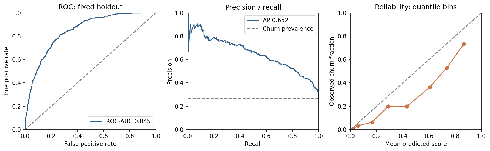
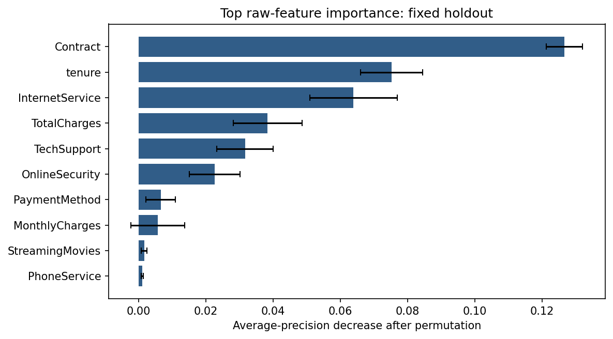
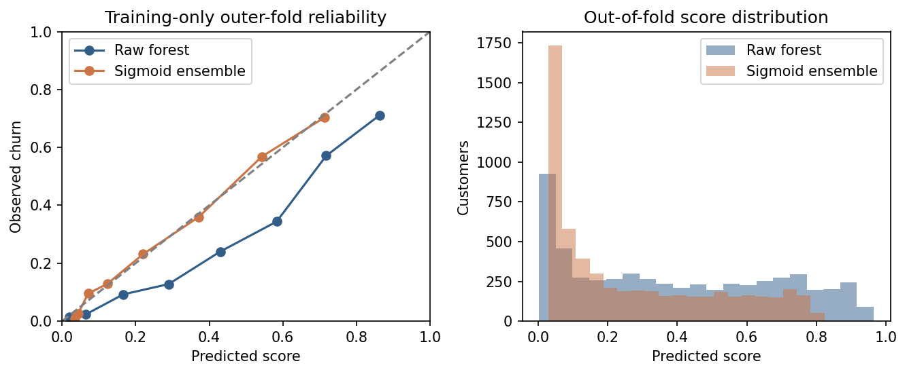

# Telco customer churn

A small, reproducible classification project with a leakage-safe training pipeline
and single-customer JSON inference. The implementation uses Logistic Regression
as a baseline and a tuned Random Forest as the tree ensemble.

## Quick start

Tested locally with Python 3.10.12; CI targets Python 3.11. Use a fresh virtual environment from the repository root:

```bash
python3 -m venv .venv
source .venv/bin/activate
python -m pip install -r requirements.txt
python -m pip install -e .
python download_data.py
python -m telco_churn.train --data data/telco.csv --output artifacts
python predict.py --input sample_customer.json
pytest -q
```

On Windows, activate with `.venv\Scripts\activate` instead.
The data downloader needs network access to Kaggle. If access is unavailable,
download the CSV from the source below and save it as `data/telco.csv`.
The saved `artifacts/model.joblib` is already included for inference without retraining.
Always install the pinned dependencies before loading it.

Input can also be piped through stdin:

```bash
cat sample_customer.json | python predict.py
```

Example output from the included model:

```json
{"prediction": 1, "churn": "Yes", "churn_probability": 0.7975335395589493, "threshold": 0.5}
```

`prediction` is 1 for churn and 0 otherwise. `churn_probability` is the model's
positive-class score, not a validated calibrated risk estimate. Missing required
fields, invalid numeric values, negatives and unexpected fields are rejected.
Blank/null numeric values are handled by the learned imputer; unseen categorical
values are ignored by the fitted encoder. `customerID` is accepted but not modeled.
This is a standalone inference script, not a hosted API or production service.

## Data and exploratory analysis

Source: [Kaggle Telco Customer Churn, blastchar](https://www.kaggle.com/datasets/blastchar/telco-customer-churn),
version 1. The source describes an IBM sample dataset with services, contracts,
charges, demographics and whether a customer left in the last month.
The download contains **7,043 rows and 21 columns**. The dataset is not committed;
`data/README.md` records its expected checksum. No private customer data is used.

`notebooks/eda.ipynb` includes executed outputs for training-set types, missing
values, numerical distributions, class balance, contract associations and model
comparisons. To re-execute after training:

```bash
python -m ipykernel install --user --name telco-churn --display-name "Telco Churn"
python - <<'PY'
from pathlib import Path
import nbformat
from nbclient import NotebookClient
p = Path("notebooks/eda.ipynb")
nb = nbformat.read(p, as_version=4)
NotebookClient(nb, timeout=120, kernel_name="telco-churn",
               resources={"metadata": {"path": str(Path.cwd())}}).execute()
nbformat.write(nb, p)
PY
```

Exploration uses the same training partition as training. `TotalCharges` is
converted from strings, with whitespace treated as missing. Learned numeric
median imputation, scaling, categorical mode imputation and one-hot encoding
are inside a sklearn `Pipeline`, so each CV fold learns them only on its training
rows. Neither target nor customer identifier enters the features.

## Validation and model choice

- Fixed seed 42; stratified 80/20 split: **5,634 training**, **1,409 holdout** rows.
- Training churn prevalence: **26.54%**. Both models use balanced class weights;
  no global oversampling or preprocessing before CV.
- Five-fold stratified CV. Random Forest searches eight combinations of depth,
  leaf size and feature fraction, each with 150 trees.
- Hyperparameters and final model are selected by **training CV average precision**.
  Holdout scores are computed once for comparison, not used to select the model
  or threshold. CV scores for the tuned forest are selection-optimistic; the
  untouched holdout is the better final estimate.
- Threshold is fixed at 0.5 for F1, precision and recall. No holdout threshold tuning.

### Measured results

| Model | CV ROC-AUC | CV PR-AUC (AP) | CV F1 | Holdout ROC-AUC | Holdout PR-AUC (AP) | Holdout F1 |
|---|---:|---:|---:|---:|---:|---:|
| Logistic Regression | 0.8459 | 0.6600 | 0.6279 | 0.8413 | 0.6326 | 0.6136 |
| Tuned Random Forest | 0.8480 | 0.6643 | 0.6324 | 0.8449 | 0.6523 | 0.6332 |

Selected: **Random Forest**, based on CV AP 0.6643, with max depth 6,
min samples per leaf 2 and max features 0.7. Its holdout precision is **0.5351**
and recall **0.7754**. Confusion matrix: TN=783, FP=252, FN=84, TP=290.
The gain over the baseline is modest, not proof of statistical superiority.
Machine-readable results and full tuning results are in `artifacts/metrics.json`
and `artifacts/cv_results.csv`.

### Why not accuracy alone?

An always-no-churn classifier would score about 73.46% accuracy on training data
while identifying no churners. ROC-AUC evaluates ranking across thresholds; average
precision focuses on positive-class precision/recall under imbalance; F1 summarizes
the precision/recall trade-off at the chosen threshold. PR-AUC here means sklearn
**average precision**, not trapezoidal area under a plotted PR curve.

## Project layout

```text
src/telco_churn/data.py       Schema cleaning and reproducible split
src/telco_churn/train.py      Fold-safe pipelines, tuning, evaluation, serialization
src/telco_churn/inference.py  Single-customer inference
predict.py                   JSON CLI
sample_customer.json         Assessment example input
notebooks/eda.ipynb           Executed exploratory analysis
artifacts/                   Saved model, metrics, tuning results
reports/                     EDA charts
tests/                      Input, serialization, pipeline and CLI tests
```

Tests cover numeric parsing/missing values, invalid inputs, unknown categories,
serialization consistency, inference output, CLI failures and a check that inference
does not change learned training medians. The included model is fitted on the
training partition only to preserve the reported holdout comparison.

## If given two extra days

1. **Decision quality and calibration.** Use training-only out-of-fold predictions
   to choose a threshold from retention cost/value, measure probability calibration
   and bootstrap uncertainty. Validate on a temporal/external dataset where possible.
2. **Serving and contracts.** Wrap inference in a versioned FastAPI schema, add
   bounded input/category validation, health checks, containerization, integration
   tests and CI. Record model/data versions and enforce trusted artifact loading.
3. **Lifecycle and monitoring.** Add reproducible experiment tracking, data-contract
   checks and drift/performance monitoring with labeled feedback. Define retraining
   and rollback criteria rather than claiming automatic retraining is safe.

## Limits and safe use

This static sample does not prove future business performance. Associations are
not causal. Class weighting can distort probability calibration; validate before
using scores for business decisions. There is no deployment, live monitoring or
real customer intervention here. Joblib uses pickle internally: load only trusted
local artifacts, never arbitrary uploaded model files. The dataset page lists
"Data files © Original Authors"; this repository links the data rather than
relicensing or redistributing it.

## Post-selection diagnostics

`reports/diagnostics.json` and the two plots below add uncertainty, probability
quality and raw-feature explainability without changing the selected model.

| Fixed-model holdout metric | 95% percentile bootstrap interval (500 resamples) |
|---|---:|
| ROC-AUC | 0.8222-0.8669 |
| Average precision | 0.5986-0.7037 |
| F1 at 0.5 | 0.5923-0.6656 |

These intervals include evaluation-sample variation only, not retraining or
model-selection uncertainty. They are descriptive, not evidence of superiority
over the baseline. Brier score is **0.1594** and log loss is **0.4750**. The
reliability curve shows overestimated churn scores in several bins; probabilities
must not be treated as calibrated business risk.





Permutation importance uses five shuffles per original feature and the decrease
in holdout average precision. Contract, tenure and InternetService have the largest
measured decreases. Correlated variables can share importance; these findings are
associations, not causal recommendations. The holdout diagnostics must not be used
to select new features or tune the next model. More honest improvement requires
training-only validation or a fresh external/temporal sample.

## Optional training-only calibration experiment

```bash
python -m telco_churn.calibration_experiment
```

This separate diagnostic uses three outer folds on the **5,634 training rows
only**, with three-fold hyperparameter search within each outer training fold.
Sigmoid calibration wraps the entire pipeline in internal three-fold calibration.
The outer validation rows are unseen by both tuning and calibration. It does not
change the included inference model or use the 1,409 holdout rows.

| Outer-fold training estimate | Raw tuned forest | Sigmoid calibrated ensemble |
|---|---:|---:|
| Brier score (lower is better) | 0.1565 | 0.1348 |
| Log loss (lower is better) | 0.4707 | 0.4167 |
| ROC-AUC | 0.8454 | 0.8469 |
| Average precision | 0.6513 | 0.6538 |
| F1 at fixed 0.5 | 0.6365 | 0.6023 |



The measured probability-quality improvement is useful, but F1 at 0.5 decreases.
Calibration is not a free improvement to every metric. The calibrated variant also
averages multiple fitted models, so differences are not caused by the sigmoid map
alone. This remains an optional experiment; the reviewed baseline/default artifact
is unchanged. A business threshold needs cost/value information and training-only
validation, not retuning against the already inspected holdout. Full fold parameters
and caveats are in `reports/calibration_experiment.json`.
